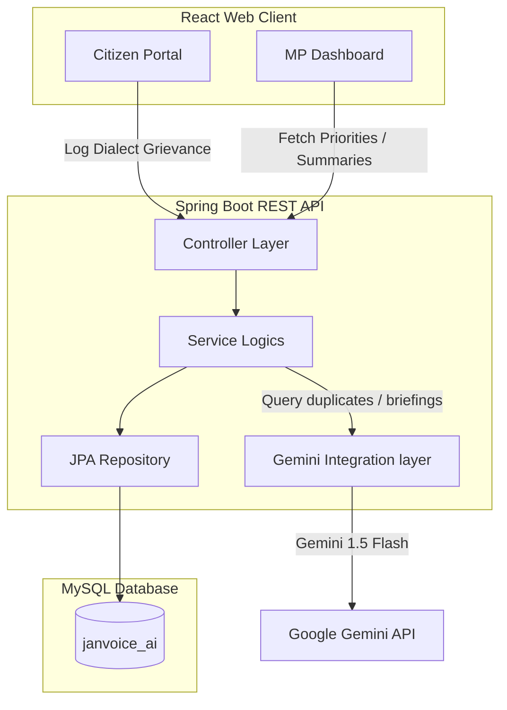

# JanVoice AI 🎙️🏛️
> **AI-Powered Citizen Grievance Redressal & Intelligent Prioritization Platform**  
> *Built for "Build with AI: Code for Communities" Hackathon*

JanVoice AI is a full-stack municipal grievance redressal application designed to bridge the gap between citizens speaking regional dialects and constituency lead representatives. Leveraging the power of Google's **Gemini 1.5 Flash API**, JanVoice translation-deduplicates scattered incoming reports, aggregates local community upvotes, and synthesizes dynamic summaries to assist Members of Parliament (MPs) in resolving local community priorities.

---

## 🏗️ Relational Architecture & Visual Flow


---

## 🛠️ Technology Stack
*   **Frontend**: React (Vite), Tailwind CSS (v4), Chart.js (with react-chartjs-2 for analytics visualization), Lucide React.
*   **Backend**: Spring Boot MVC 3.2.5, JPA/Hibernate, Maven, standard validation bindings.
*   **AI Integration**: Google Gemini 1.5 Flash client over REST.
*   **Database**: MySQL 8.x database storage.

---

## 🔮 Core Gemini AI Workflows

### 1. Unified Dialect Ingestion & Translation
Citizens report municipal grievances in their regional idioms or record voice files (e.g. speaking Hindi: *"सड़क खराब है"*). The backend transmits the text stream directly to Gemini 1.5 Flash with custom framing, obtaining a JSON payload:
- **Translated Text**: English translation of the grievance.
- **Language**: Source language code (e.g., Hindi `hi`, Bengali `bn`, Telugu `te`).
- **Category**: Classifies into defined divisions (`ROADS`, `WATER`, `SANITATION`, `ELECTRICITY`).
- **Urgency Rating**: Categorizes as `CRITICAL`, `HIGH`, `MEDIUM`, or `LOW`.

### 2. Multi-tenant Semantic Deduplication
When a citizen logs a grievance, the backend pulls active open reports in the same Category and Ward Area. Gemini compares the new entry against these open tickets. If it detects a duplicate (e.g., reporting the same main street water leak):
- The new ticket is flagged as a child duplicate of the master ticket (`parent_complaint_id`).
- The system automatically triggers an upvote transaction on the master ticket, magnifying its local priority weight.
- Keeps constituency queues free of redundant spam!

### 3. Dynamic Executive briefings
When the MP loads their dashboard, the service compiles all unresolved grievances within their Ward constituency. Gemini synthesizes the logs into a high-level briefing detailing crucial pain points, priority issues, and mitigation recommendations.

---

## 🚀 Quick Local Setup Setup

### ⚙️ Prerequisites
*   Java SDK 17 or higher.
*   Node.js (v18+).
*   MySQL Server (port 3306).
*   A Gemini API Key (obtain from Google AI Studio).

### 🖥️ 1. Database Setup
Create a local MySQL database named `janvoice_ai`:
```sql
CREATE DATABASE janvoice_ai;
```
Configure your credentials in `backend/src/main/resources/application.properties` (defaults are set for username: `root`, password: `root` on standard port 3306).

### ☕ 2. Running the Spring Boot Backend
Configure your Gemini API Key in the environment shell:
```powershell
# Windows PowerShell
$env:GEMINI_API_KEY="AIzaSyYourApiKeyHere..."

# Linux / macOS
export GEMINI_API_KEY="AIzaSyYourApiKeyHere..."
```

Navigate to the `backend/` directory and start:
```bash
mvn spring-boot:run
```
The database tables and mock users will automatically populate on bootstrap!

### ⚛️ 3. Running the React Frontend
Navigate to the `frontend/` directory, install packages, and spin up the Vite development server:
```bash
npm install
npm run dev
```
Open your browser and navigate to `http://localhost:5173`.

---

## ⚡ Hackathon Live Demo Walkthrough
To make judging evaluations as seamless as possible, we have incorporated **credentials autofill buttons** on the sign-in screen:

1.  **Log in as a Citizen**:
    - Click **Autofill Citizen (Ward 5)** and sign in.
    - Click **Voice Record (Hindi)** to simulate a citizen speaking Hindi. The system automatically registers Hindi text.
    - Click **File Complaint**. The backend invokes Gemini: translating it to English, matching it as category `SANITATION` / urgency `HIGH`, detecting it as duplicate, and adding an upvote directly to the existing Ward 5 sewer issue!
2.  **Log in as an MP**:
    - Click **Autofill MP Dashboard** and sign in.
    - View aggregate count metrics, category distribution graphs, and the **Gemini AI Executive Briefing** summarizing active Ward constituency concerns.
    - Transition complaint statuses from `Pending` → `In Progress` → `Resolved` and see priorities dynamically re-sort!
